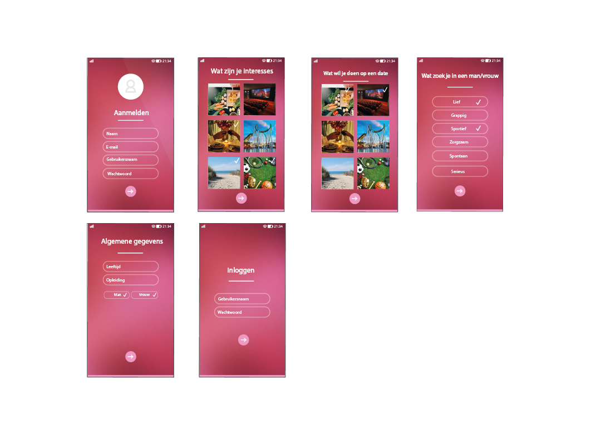

# Feliz

This is my datingapp for project Tech. This is a project for my study communication and multimedia design. This is a 10 week project.

### About Feliz
Feliz is a dating site that matches you based on interests like sports, cooking, movies etc. When creating an account, you specify your preferences for what you would like to do on a date or, what you're looking in someone. After creating your account you will be matched based on these interests



## Wiki
You can read my proces for my datingsite here including my research:

[Wiki](https://github.com/emmaoudmaijer/datingsite/wiki)

## Installation

To install this repository, type: 

```
Git clone https://github.com/emmaoudmaijer/datingsite
```
To install Node modules, type:
```
npm install
```
To run the application, type
```
npm run start
```
Make an .env file and put it in .gitignore
```
Add DB_NAME: 
Add database connection MONGO_DB: ""
Add SESSION_SECRET: 
```

## License
[MIT](https://github.com/emmaoudmaijer/datingsite/blob/master/LICENSE)
